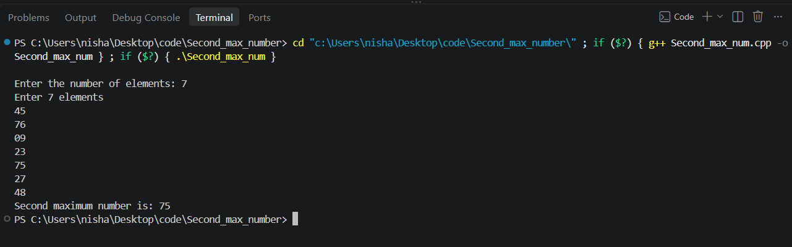

1)  Approach Explanation  -------------

First I take the size of the array and then take all the elements as input.

I use two variables called `first_max` and `second_max`. First I keep the first element as `first_max`. Then I check every other element one by one........

If the current element is greater than `first_max` then the old `first_max` becomes `second_max` and current element becomes `first_max`......

If the current element is not equal to `first_max` and it is greater than `second_max`, then I update `second_max`.

In this way, I can find the second largest unique number .......

2)  complexitites ----------

Time Complexity: O(n) ( we've travel one time  on array )

Space Complexity: O(n) (storing the element of `len` length )

3) input/output

